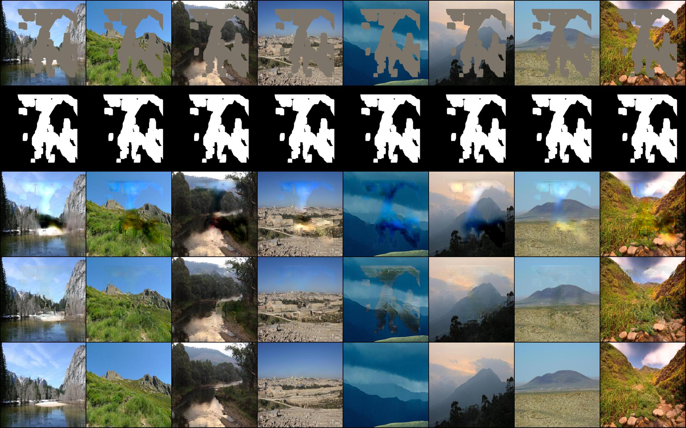
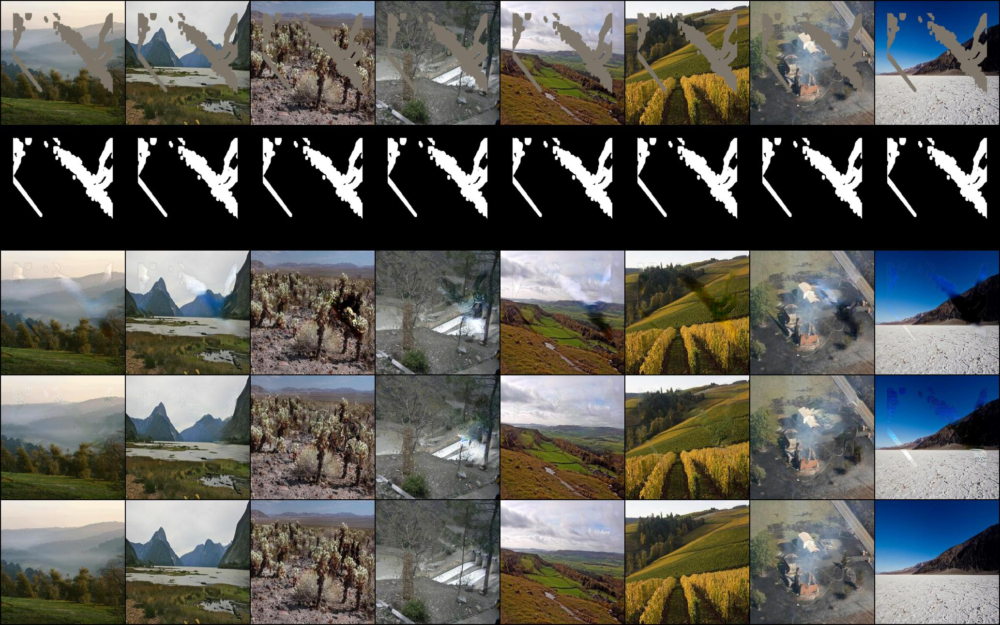

### 2018-eccv Image Inpainting for Irregular Holes Using Partial Convolutions PaddlePaddle版本复现

这次复现主要参考了原论文和两个pytorch版本的源码：

**官方源码**：https://github.com/NVIDIA/partialconv

**非官方源码**：https://github.com/naoto0804/pytorch-inpainting-with-partial-conv

因为官方源码把两篇论文的方法写在一起了，比较乱，所以只参考了PartialConv的实现部分。

**原文中的效果**：


其中第三列是论文中展示的效果，但其实自己复现的效果并没有这么优秀，下面是我用非官方版pytorch复现的效果（从左到右三列所用的mask面积依次是0.1-0.2，0.2-0.3，0.3-0.4的）：


当时训练是batchsize为4，迭代了50万次，因为celeba_hq的训练集有3万张图片，大概就是66个epoch，之后又微调了50万次迭代。效果其实并没有论文那么好（只能说作者太会挑图了）。此外也有几篇其他有关image inpainting的论文做了和PartialConv的对比试验，他们的复现效果如下：

下图是ICCV2019 Coherent Semantic Attention for Image Inpainting对PC做的复现


下图是IJCAI 2019 Coarse-to-Fine Image Inpainting via Region-wise Convolutions and Non-Local Correlation对PC的复现结果（其中第四列是PC的效果）：


可以看出在celeba的表现上都不是特别好。

下面是我的paddlepaddle版本对pc的复现，下面是没有微调的效果，微调后效果可能会进一步提升。

**视觉效果**：

这里我做测试的时候，随机从irregular mask数据集（1.2w张mask图片）中进行选择，对测试集进行修复：


**与非官方版的对比：**

​	下面几张图是我用非官方版的预训练模型在place2上测试的结果，测试方法是，随机从irregular mask的数据集中选取8张mask，从place2的测试集中随机选取8张图片，将修复结果拼接（第一行是input，第二行是mask，第三行是output，第四行是ground truth）。下面三张图是三次测试的结果。虽然视觉上效果不如我的paddle版本，但是因为几个客观问题的存在，这两个模型不具有可比性。首先，place2的语义本来就比人脸复杂，所以对于大面积的mask的效果不如人脸是正常的，其次是因为我做测试的时候是随机从1.2w张mask中选了几张做测试，不同的mask对结果的影响自然是不同的。

​	但是其实这个方法本来就是18年的，不管是pytorch版本或者是我复现的版本，都存在方法本身的局限性，首先是修复图片中伪影严重，其次对于空白区域过大的mask会出现效果极差的情况。这两种情况可能是方法本身的问题，首先因为mask是逐层更新，每一层都会有新的mask，这会导致在mask区域过大的时候，在encoder的最后一层，mask中依然还有value为0的区域，这部分的语义是无法修复的，且通过skip connect可能会破坏decoder对图片的修复过程，其次是encoder的每一层的input都是上一层的output与上一层更新的new_mask做相乘，即:
$$
input_i=output_{i-1}*mask_{i-1}
$$
这会导致本身上一层对于mask为0区域修复的纹理和语义，在下一层会被破坏，导致语义和结构都会出现不连贯的情况（以及伪影）。partial conv这个方法其实挺有用的，我的想法是，如果想提高视觉效果和指标，最简单的操作应该是把partialconv作为残差加到encoder中。






**训练方法：**

```
train.py
```

**测试方法：**

```
test.py
```

**预训练模型：**

lr=0.0002训练了60w个iterate的结果，个人感觉再改变学习率微调会进一步提升效果

链接：https://pan.baidu.com/s/113xENcVYzcOfQQZJb-CYjA 
提取码：pdpd

**训练日志：**

这里我用了paddlepaddle的visualDL来记录自己的日志，查看方法：

```
visualdl --logdir ./logs/Celeba
```

