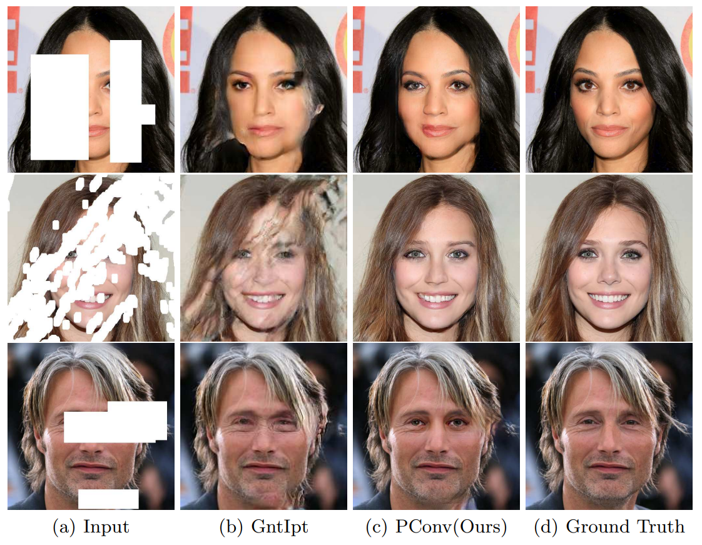
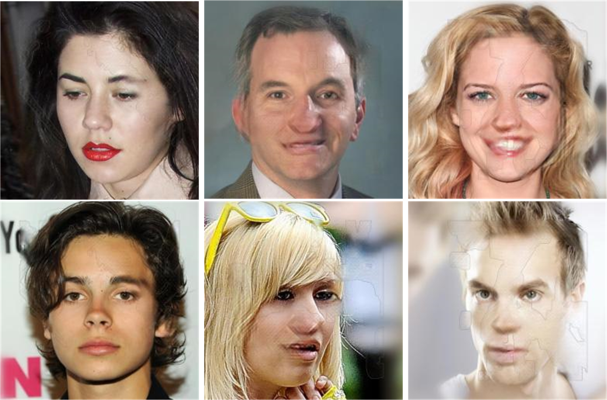
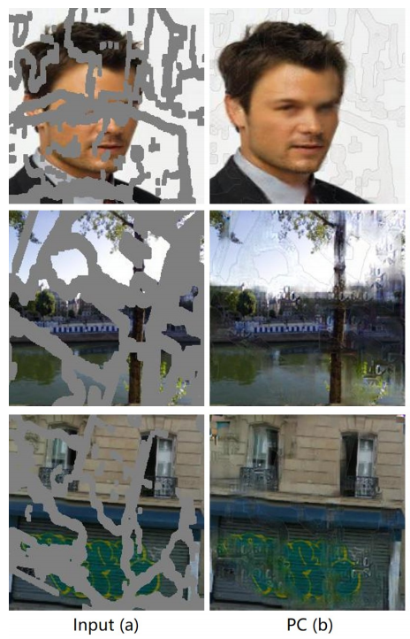

### 2018-eccv Image Inpainting for Irregular Holes Using Partial Convolutions PaddlePaddle复现

这次复现主要参考了原论文和两个pytorch版本的源码：

官方源码：https://github.com/NVIDIA/partialconv

非官方源码：https://github.com/naoto0804/pytorch-inpainting-with-partial-conv

因为官方源码把两篇论文的方法写在一起了，比较乱，所以只参考了PartialConv的实现部分。

原文中的效果：

其中第三列是论文中展示的效果，但其实自己复现的效果并没有这么优秀，下面是我复现的效果（pytorch版）：

当时训练是batchsize为4，迭代了50万次，因为celeba_hq的训练集有3万张图片，大概就是66个epoch，之后又微调了50万次迭代。效果其实并没有论文那么好（只能说作者太会挑图了）。此外也有几篇其他有关image inpainting的论文做了和PartialConv的对比试验，他们的复现效果如下：

下图是ICCV2019 Coherent Semantic Attention for Image Inpainting对PC做的复现

下图是IJCAI 2019 Coarse-to-Fine Image Inpainting via Region-wise Convolutions and Non-Local Correlation对PC的复现结果（其中第四列是PC的效果）：

可以看出在celeba的表现上都不是特别好。

下面是我的paddlepaddle版本对pc的复现，由于时间和设备关系，这是训练的第21个epoch的效果：

指标epoch：21
mask_0.1-0.2: PSNR: 29.2551  SSIM: 0.9610  l1: 0.0119
mask_0.2-0.3: PSNR: 26.4026  SSIM: 0.9157  l1: 0.0178
mask_0.3-0.4: PSNR: 24.2461  SSIM: 0.8813  l1: 0.0264

视觉效果：

